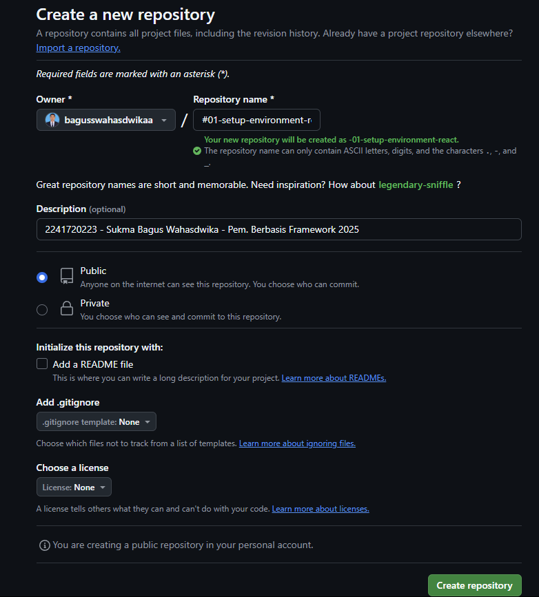
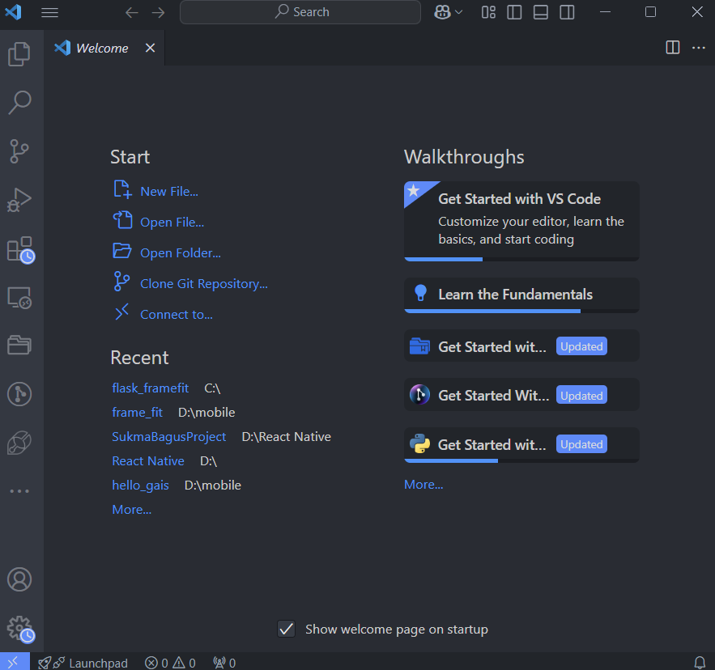
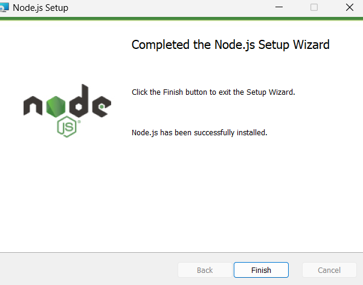
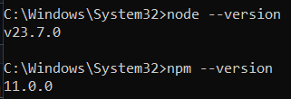
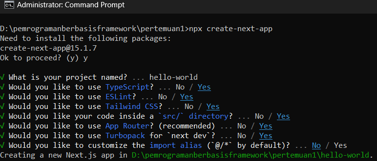
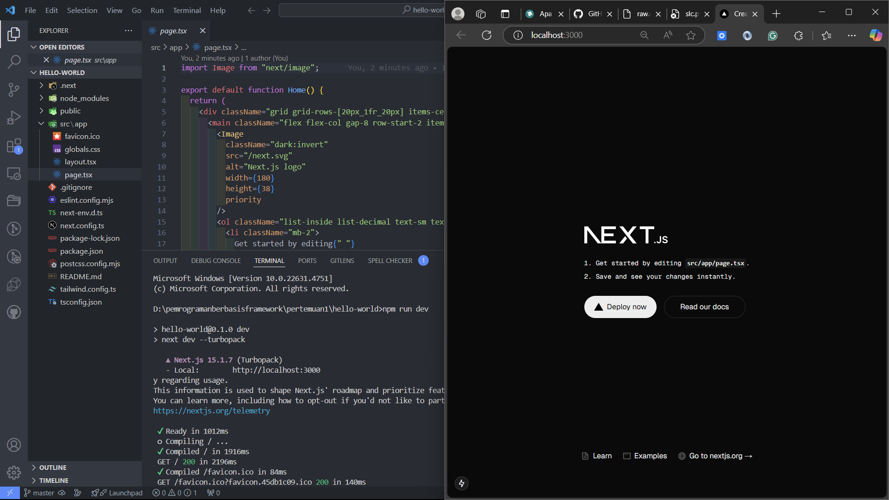
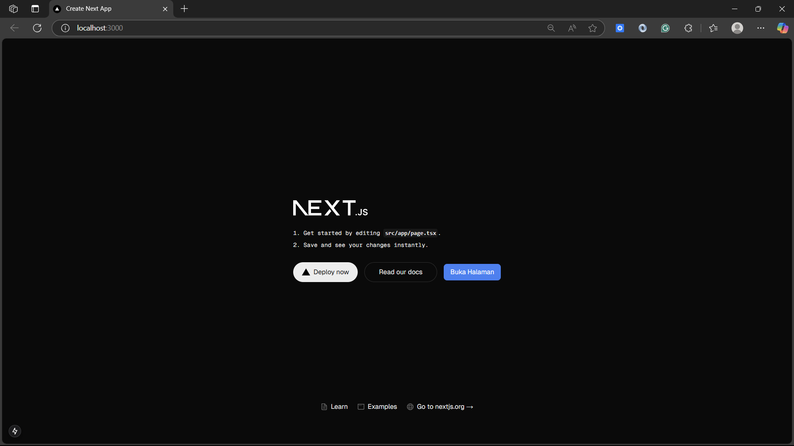

## Laporan Praktikum

|  | Pemrograman Berbasis Framework 2025 |
|--|--|
| NIM |  2241720223|
| Nama |  Sukma Bagus Wahasdwika |
| Kelas | TI - 3D |

### Praktikum 1 : Menyiapkan Lingkungan Pengembangan
1. Jelaskan kegunaan masing-masing dari Git, VS Code dan NodeJS yang telah Anda install pada sesi praktikum ini!
    - Git adalah alat yang berfungsi sebagai Version Control System (VCS) untuk melacak dan mengelola perubahan kode dalam proses pengembangan perangkat lunak.
    - VS Code adalah editor teks yang digunakan untuk menulis, mengedit, dan mengelola kode program dengan berbagai fitur yang mendukung produktivitas pengembang.
    - NodeJS adalah lingkungan runtime berbasis JavaScript yang memungkinkan menjalankan kode JavaScript di luar browser, terutama di sisi server.

2. Bukti setup environment telah berhasil di  komputer.

- Instalasi Git

  

  

- Instalasi VS Code

  

- Instalasi NodeJS dan NPM

  

  

### Praktikum 2 : Membuat Proyek Pertama React Menggunakan Next.js
1. Pada Langkah ke-2, setelah membuat proyek baru menggunakan Next.js, terdapat beberapa istilah yang muncul. Jelaskan istilah tersebut, TypeScript, ESLint, Tailwind CSS, App Router, Import alias, App router, dan Turbopack!
    - TypeScript adalah bahasa pemrograman berbasis JavaScript yang menambahkan tipe data statis untuk meningkatkan struktur kode dan mengurangi bug.
    - ESLint adalah alat untuk memastikan kode JavaScript atau TypeScript sesuai dengan aturan standar yang ditentukan.
    - Tailwind CSS adalah framework CSS yang menyediakan berbagai kelas siap pakai untuk mempercepat pembuatan tampilan tanpa menulis CSS secara manual.
    - App Router adalah sistem routing Next.js terbaru yang mengatur navigasi berdasarkan struktur folder app/.
    - Import alias memungkinkan penulisan jalur impor yang lebih ringkas dan mudah dibaca.
    - Turbopack adalah bundler baru dari Vercel yang menggantikan Webpack, dirancang untuk meningkatkan kecepatan build dan pengembangan proyek Next.js.

2. Apa saja kegunaan folder dan file yang ada pada struktur proyek React yang tampil pada gambar pada tahap percobaan ke-3!
    - .next/ → Folder hasil build dari Next.js yang berisi cache, file build, dan optimasi performa.
    - node_modules/ → Folder yang menyimpan semua dependensi (library dan package) yang diinstal.
    - public/ → Folder untuk menyimpan file statis seperti gambar, font, dan favicon yang bisa diakses langsung melalui URL.
    - src/app/ → Folder utama untuk komponen dan halaman aplikasi menggunakan App Router.
    - File dalam src/app/ yang dibutuhkan:
      =>favicon.ico → Ikon yang muncul di tab browser.
      =>globals.css → File CSS global untuk styling seluruh aplikasi.
      =>layout.tsx → Menentukan tata letak global (misalnya header dan sidebar).
      =>page.tsx → Halaman utama (/), setara dengan index.js di React.
      .gitignore → Menentukan file atau folder yang diabaikan oleh Git, seperti node_modules/ dan .next/.
  - eslint.config.mjs → Konfigurasi ESLint untuk memastikan kode tetap bersih dan sesuai standar.
  - next-env.d.ts → Memastikan proyek Next.js berjalan dengan TypeScript tanpa konfigurasi tambahan.
  - next.config.ts → File konfigurasi Next.js untuk mengatur base path, optimasi gambar, dan lainnya.
  - package-lock.json → Mengunci versi dependensi agar tidak berubah.
  - package.json → Berisi informasi proyek, daftar dependensi, dan skrip npm.
  - postcss.config.mjs → Konfigurasi PostCSS, biasanya digunakan dengan Tailwind CSS.
  - README.md → Dokumentasi proyek yang berisi petunjuk penggunaan dan informasi penting lainnya.
  - tailwind.config.ts → Konfigurasi Tailwind CSS, seperti tema warna dan breakpoint.
  - tsconfig.json → Konfigurasi TypeScript yang menentukan aturan penggunaan tipe data di proyek.

3. Buktikan dengan screenshoot yang menunjukkan bahwa tahapan percobaan di atas telah berhasil Anda lakukan!

- Create Project Hello World

    

- Running Project Hello World

    

### Praktikum 3 : Menambahkan Komponen React (Button)
1. Menambahkan fungsi MyButton di file page.tsx yang mengembalikan markup komponen button yang akan ditambahkan ke dalam webpage

  

  

2. Buktikan dengan screenshoot yang menunjukkan bahwa tahapan percobaan di atas telah berhasil Anda lakukan!

  

### Praktikum 4 :  Menulis Markup dengan JSX
1. Untuk apakah kegunaan sintaks user.imageUrl?
    - Sintaks user.imageUrl berfungsi untuk mengakses nilai dari properti imageUrl yang terdapat dalam objek user, yang berisi URL gambar pengguna.

2. Buktikan dengan screenshoot yang menunjukkan bahwa tahapan percobaan di atas telah berhasil Anda lakukan!

  

